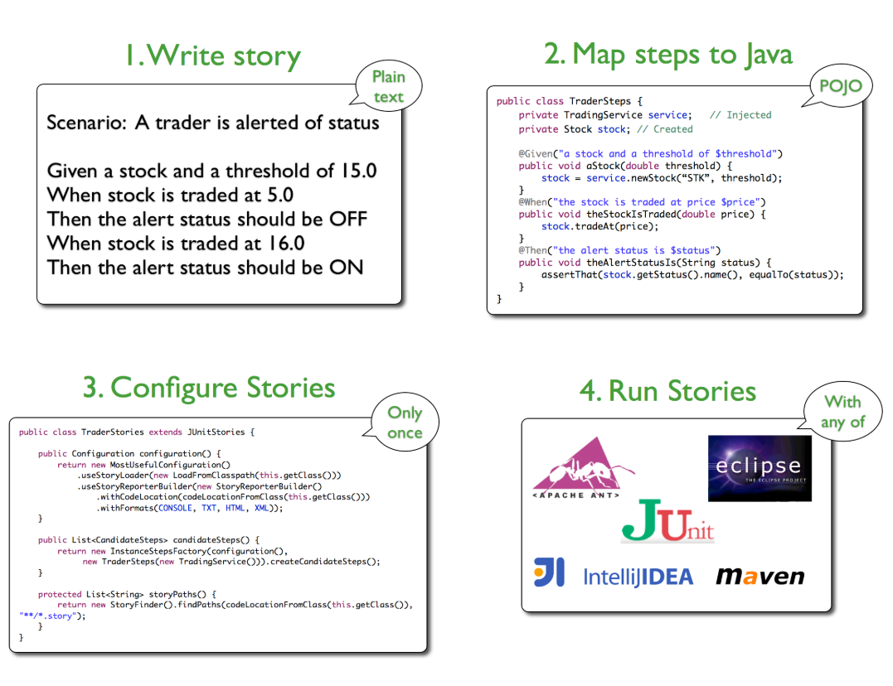

# tessa-ui-automation
UI automation for Copperleaf Cost 

This is a prototype of the test cases and the structure of the repository.
 
 com.tessa.stories (This is the collection of specifications for the test cases)
 e.g ScopeSheet.story (in Given, when, and, then format.)
 
 com.tessa.steps (Mapping of the test steps to java code. This contains the actual code for the test case.)
 e.g. ScopeSheetSteps.java
 
 com.tessa.story (This is configuration of running a story.)
 e.g. ScopeSheetStory.java

